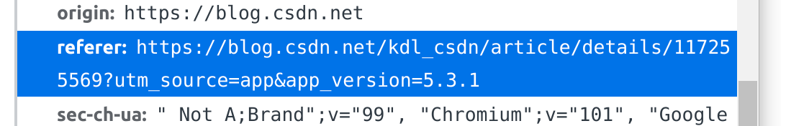

# 爬虫基础知识

[这次不会说我的正则教程没写全了吧？？](https://juejin.cn/post/6844903680349585422)

[一篇文章了解爬虫技术现状](https://juejin.cn/post/6844903469988462599)

[如果有人问你爬虫抓取技术的门道，请叫他来看这篇文章](https://juejin.cn/post/6844903518390714381)

[Python爬虫知识梳理](https://juejin.cn/post/6844903497037529096)

[一篇了解爬虫技术方方面面](https://juejin.cn/post/6844903469367705607)

[爬虫学习资源整理](https://juejin.cn/post/6844903466163240968)

[网络爬虫之页面解析](https://juejin.cn/post/6897131531177820168)

[selenium-Chrome 操作cookie](https://juejin.cn/post/6844903586741092360)

[【爬虫知识】你真的完全了解了 post 和 get 的区别和联系吗？](https://blog.csdn.net/kdl_csdn/article/details/114626154?utm_source=app&app_version=5.3.1)

[Python爬虫：什么是Python爬虫？怎么样玩爬虫？](https://juejin.cn/post/6899724019239485447)

[爬虫，其实本就是这么简单](https://juejin.cn/post/6844903918816903182)

[一言不合就改成 777 权限？会出人命的！](https://juejin.cn/post/6844903694509539336)

[[译] 如何使用 Python 和 BeautifulSoup 爬取网站内容](https://juejin.cn/post/6844903657666773006)

[妈妈再也不用担心爬虫被封号了！手把手教你搭建Cookies池](https://juejin.cn/post/6844903589421252622)

[这可能是你见过的最全的网络爬虫干货总结！](https://juejin.cn/post/6844903697047257101)

[为什么每一个爬虫工程师都应该学习 Kafka](https://juejin.cn/post/6844904020339851271)

[一个神器，大幅提升爬取效率](https://juejin.cn/post/7070076323477061646)

[爬虫技术(二)－客户端爬虫](https://juejin.cn/post/6844903469866811400)

[三种 Python 网络内容抓取工具与爬虫](https://juejin.cn/post/6844903509154873357)

[图解爬虫，用几个最简单的例子带你入门Python爬虫](https://juejin.cn/post/6963876825592233991)

[Python爬虫从入门到精通（三）简单爬虫的实现](https://juejin.cn/post/7031313180953411598)

[[译] 30 分钟 Python 爬虫教程](https://juejin.cn/post/6844903606198485005)

[Python3 网络爬虫（一）：初识网络爬虫之夜探老王家](https://juejin.cn/post/6844904149247590407)

[Python代理IP爬虫的简单使用](https://juejin.cn/post/6844903718865879047)

[Python 爬虫模拟登录方法汇总](https://juejin.cn/post/6844903701128167431)

[爬虫合法性讨论](https://juejin.cn/post/6844904191228379150)

[近期的爬虫工作杂谈](https://juejin.cn/post/6844903570047762445)

[爬虫工程师劝退文](https://juejin.cn/post/6844903584539082766)

# 爬虫项目

[淘宝直播弹幕爬虫](https://juejin.cn/post/6844903520429146125)

[资源整理 | 32个Python爬虫项目让你一次吃到撑](https://juejin.cn/post/6844903493715640327)

[[译] 我是如何从零开始建立一个网络爬虫来实现我的求职自动化的](https://juejin.cn/post/6844903632874242061)

[【爬虫实战】一起一步步分析亚马逊的反爬虫机制](https://juejin.cn/post/6974300157126901790)

[30行js爬取顶点全网任意小说](https://juejin.cn/post/6844903472131735560)

[房价在手，天下我有 --反手就撸一个爬虫(始)](https://juejin.cn/post/6844903648460275726)

[60行代码爬取知乎神回复](https://juejin.cn/post/6844903714445082638)

[利用Python网络爬虫抓取网易云音乐歌词](https://juejin.cn/post/6844903602322931726)

[这 6 个爬虫开源项目 yyds](https://juejin.cn/post/7028533507164995598)

[python爬虫学习：爬虫QQ说说并生成词云图，回忆满满](https://juejin.cn/post/6844903605242183687)

[重构：抓取一个视频网站上 2016 年所有电影的下载链接](https://juejin.cn/post/6844903462421921805)

[3天破9亿！上万条评论解读《西虹市首富》是否值得一看](https://juejin.cn/post/6844903649047478280)

[大数据获取案例：Python网络爬虫实例](https://juejin.cn/post/6861124900988387335)

[《抖音APP》爬虫思路分享总结](https://juejin.cn/post/6844903625219817479)

[如何一小时爬取百万知乎用户信息，并做了简单的分析](https://juejin.cn/post/6844903472463085576)

[分析了京东内衣销售记录，告诉你妹子们的真Size！](https://juejin.cn/post/6844903897425772552)

[（爬虫）书籍和电影，程序员不可或缺](https://juejin.cn/post/6844903620832411655)

[Python 爬虫：把廖雪峰的教程转换成 PDF 电子书](https://juejin.cn/post/6844903463063650311#comment)

# Scrapy框架
[Python爬虫系列之----Scrapy(七)使用IP代理池](https://juejin.cn/post/6844903620383604750)

# 多线程/进程
[Python异步爬虫](https://juejin.cn/post/6898627613657743368)

[爬虫速度太慢？来试试用异步协程提速吧！](https://juejin.cn/post/6844903635407618062)

[python爬虫之多线程、多进程爬虫](https://juejin.cn/post/6977256183069409293)

[简易多线程爬虫框架](https://juejin.cn/post/6844903615828590599)

# 分布式爬虫
[创建一个分布式网络爬虫的故事](https://juejin.cn/post/6844903502909538317)

[如何简单高效地部署和监控分布式爬虫项目](https://juejin.cn/post/6844903713622982664)

[分布式爬虫原理之分布式爬虫原理](https://juejin.cn/post/6844903610086621191)

# 反爬技术
[反击爬虫，前端工程师的脑洞可以有多大？](https://juejin.cn/post/6844903503026995214)

[爬虫神器pyppeteer，对 js 加密降维打击](https://juejin.cn/post/6844903842484584462)

[这种反爬虫手段有点意思，看我破了它！](https://juejin.cn/post/6844903994125451277)

[一行js代码识别Selenium+Webdriver及其应对方案](https://juejin.cn/post/6844903775602212877)

[Web 端反爬虫技术方案](https://juejin.cn/post/6844903654810468359)

[Python反反爬虫 - Frida破解某安卓社区token反爬虫](https://juejin.cn/post/6844903865775554568)

[滑动宫格验证码都给碰上了？没事儿，看完此文分分钟拿下！](https://juejin.cn/post/6844903590436274190)

# 细节
## 一、常见的反爬策略
[常见的反爬策略及解决方案](https://blog.csdn.net/kdl_csdn/article/details/117255569?utm_source=app&app_version=5.3.1)

爬虫一般分为数据采集，处理，储存三个部分。

>一般网站从三个方面反爬虫：a.用户请求的Headers；b.用户行为；c.网站目录和数据加载方式。大多数网站都从a、b来反爬虫。一些应用ajax的网站会采用c，增大了爬取的难度（防止静态爬虫使用ajax技术动态加载页面）。
### 1、最常见的反爬虫策略——用户请求的Headers。
**解决方法**
- 伪装header。

大部分网站都会对用户请求头Headers的`User-Agent`进行检测，部分网站会对`Referer`进行检测。

- 对于这类反爬可以直接在代码中添加Headers，将浏览器的User-Agent复制到代码的Headers中；或者将Referer值修改为目标网站域名。修改或者添加Headers就能很好地绕过检测Headers的反爬。

> **问题：`Referer`是什么意思？**
  

### 2、基于用户行为反爬虫🐛
部分网站是通过检测用户行为反爬，例如：
- 同一IP短时间内多次访问某个页面
- 同一账户短时间内进行多次相同操作

**解决方法**
- 对于`同一IP短时间内多次访问某个页面`的情况，使用IP代理就可以解决。也可以先爬取网上免费的代理ip，检测后将可用的ip全部保存起来。这样以后可以有规律地更换ip进行爬虫（如：每请求几次更换一个ip）
- 对于“同一账户短时间内进行多次相同操作”的情况，可以在每次请求后随机间隔一定时间再进行下一次请求。

### 3、动态页面反爬虫
上述的几种情况多是静态页面, 对于另一部分网站是需要通过`ajax`请求得到我们需要爬取的数据。

**解决方法**
- Selenium+PhantomJS
>Selenium：自动化web测试解决方案，完全模拟真实的浏览器环境，完全模拟基本上所有的用户操作
>PhantomJS ：一个没有图形界面的浏览器