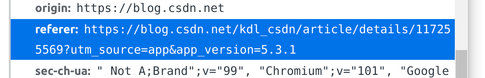

## Get与Post的区别
[【爬虫知识】你真的完全了解了 post 和 get 的区别和联系吗？](https://blog.csdn.net/kdl_csdn/article/details/114626154?utm_source=app&app_version=5.3.1)

# 反爬

## 常见的反爬策略
[常见的反爬策略及解决方案](https://blog.csdn.net/kdl_csdn/article/details/117255569?utm_source=app&app_version=5.3.1)

### 1、

> **问题：`Referer`是什么意思？**
  

### 2、基于用户行为反爬虫🐛
部分网站是通过检测用户行为反爬，例如：
- 同一IP短时间内多次访问某个页面
- 同一账户短时间内进行多次相同操作

**解决方法**
- 对于`同一IP短时间内多次访问某个页面`的情况，使用IP代理就可以解决。也可以先爬取网上免费的代理ip，检测后将可用的ip全部保存起来。这样以后可以有规律地更换ip进行爬虫（如：每请求几次更换一个ip）
- 对于“同一账户短时间内进行多次相同操作”的情况，可以在每次请求后随机间隔一定时间再进行下一次请求。

### 3、动态页面反爬虫
上述的几种情况多是静态页面, 对于另一部分网站是需要通过`ajax`请求得到我们需要爬取的数据。

**解决方法**
- Selenium+PhantomJS
>Selenium：自动化web测试解决方案，完全模拟真实的浏览器环境，完全模拟基本上所有的用户操作
>PhantomJS ：一个没有图形界面的浏览器